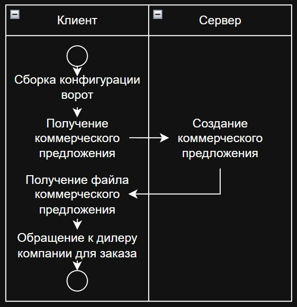
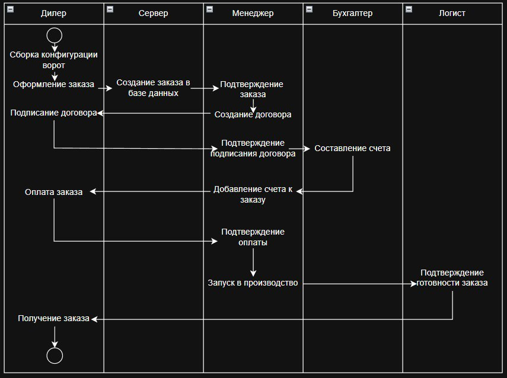

# Информационная система для производственного предприятия "Сага"

"Сага Дорс" - компания, занимающаяся производством секционных ворот. Она реализует свою продукцию через дилеров (партнеров).

Детализация основного процесса заказа ворот:

1. Для клиента
(клиент не может оформить заказ напрямую у завода, он обязан обратиться к дилеру компании)



2. Для дилера



## Основной функционал

1. Онлайн-калькулятор, позволяющий высчитать стоимость интересующих ворот

2. Личный кабинет для дилеров и менеджеров компании со списком заказов

3. Аккаунт для логиста, для оповещения о готовности заказа

4. Автоматическое формирование коммерческого предложения и договора, а также доступ к их копиям

## Стек технологий

- Server: Go
- Client: HTML+CSS+JS
- DB: PostgreSQL

## Архитектура проекта

```text
project/
├── assets/
│   ├── images/        # Картинки
│   ├── scripts/       # JS-файлы
│   ├── styles/        # CSS-файлы
│   └── proto_files/   # proto-файлы
│
├── cmd/
│   └── size_import/   # Импорт данных из Excel
│
├── docs/              # Изображения для README
│
├── pkg/
│   ├── database/      # Работа с БД
│   ├── handlers/      # HTTP-обработчики
│   ├── helpers/       # Вспомогательные функции
│   ├── models/        # GORM-модели
│   ├── proto_files/   # .pb.go-файлы
│   └── types/         # Общие типы
│
├── templates/
│   ├── admin/         # Панель администратора
│   ├── auth/          # Авторизация и регистрация
│   ├── calculator/    # Калькулятор
│   ├── info/          # Контакты, главная и т.д.
│   ├── orders/        # Заказы
│   ├── templates/     # Переиспользуемые компоненты
│   └── user/          # Аккаунт пользователя
│
└── main.go            # Главный запускаемый файл
```
